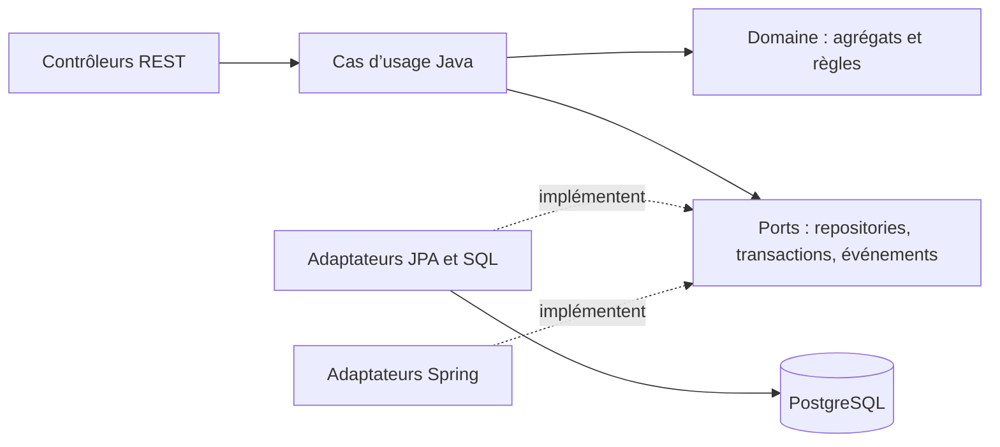

# Auto Stock Management — Backend

API de gestion de stock de pièces détachées : réception des produits, répartition entre surface de vente et réserve, ventes, paiements et suivi des créances. L’objectif est de relier chaque opération commerciale à ses mouvements de stock et à son auteur.

**Contexte et statut.** Application développée pour un client du secteur des pièces détachées et précédemment déployée sur un VPS OVHcloud, financé personnellement. Elle n’est plus accessible en ligne ; aucune démo publique ni utilisation active n’est revendiquée.

Le [frontend Angular](https://github.com/aliCheikCheikh/auto-stock-management-front) présente les parcours utilisateur. Ce dépôt porte les règles métier, l’API et la persistance.

**Démonstration.** Une vidéo de 3 min 30 montre le parcours complet (connexion, recherche, réception manuelle et CSV, vente à crédit, transfert, historiques, créances, administration). Elle a été enregistrée sur l’application réelle lancée en local, avec des données fictives, et accompagne le portfolio du projet.

## Fonctionnalités implémentées

| Besoin | Réalisation dans le code |
| --- | --- |
| Catalogue | Recherche de produits, consultation des stocks, modification et désactivation ; gestion des catégories avec contrôle des doublons. |
| Approvisionnement | Réception et création de produits lors de l’approvisionnement ; import CSV avec prévisualisation, sélection des lignes et rapport d’exécution. |
| Stock | Emplacements `SHOP_FLOOR` et `BACKSTOCK`, transferts, seuils et historique des entrées/sorties/transferts regroupés par opération. |
| Vente | Panier multiligne, allocation du stock par priorité, refus du stock insuffisant, enregistrement de la vente et des sorties. |
| Crédit | Client obligatoire pour une vente à crédit, paiements successifs, solde restant dû, liste et détail des créances. |
| Pilotage | Synthèse des ventes, encaissements, créances, alertes de stock et activité récente. |
| Accès | Connexion, renouvellement de session, rôles `OWNER`/`SELLER`, gestion des vendeurs, mots de passe temporaires et désactivation des comptes. |

Ces fonctionnalités sont présentes dans les contrôleurs et les cas d’usage. Leur présence ne constitue pas une validation complète de tous les parcours en environnement réel : voir les vérifications ci-dessous.

## Stack vérifiée

- Java **17**, Maven multimodule ; Spring Boot **3.5.13** : [POM parent](pom.xml).
- Spring Web, Security, Data JPA/Hibernate et Flyway : [POM infrastructure](stock-infrastructure/pom.xml), versions gérées par le BOM Spring Boot.
- PostgreSQL : **17** dans le Compose local ; les tests Testcontainers utilisent **16-alpine**. Les deux configurations doivent être distinguées.
- JJWT **0.12.6**, Commons CSV **1.14.1** ; JUnit Jupiter, AssertJ et Mockito pour les tests.
- Dockerfile Java 17 et [CI GitHub Actions](.github/workflows/ci.yml) exécutant `mvn verify` sur les pull requests.

## Architecture : un domaine indépendant des frameworks



Les dépendances Maven suivent `stock-infrastructure → stock-application → stock-domain`. Les deux modules internes n’ont pas de dépendance de production à Spring ou JPA. L’infrastructure assemble les objets dans [UseCaseConfiguration](stock-infrastructure/src/main/java/com/aliCheikh/stock/infrastructure/config/UseCaseConfiguration.java).

- **Domaine** : agrégats `Sale`, `Product`, `StorageLocation`, objets-valeurs `Money` et identifiants typés, règles de crédit et d’allocation. [StockAllocationService](stock-domain/src/main/java/com/aliCheikh/stock/domain/service/StockAllocationService.java) répartit une vente entre emplacements en contrôlant la disponibilité. [Sale](stock-domain/src/main/java/com/aliCheikh/stock/domain/model/sale/Sale.java) porte les règles de vente et de paiement.
- **Application** : [SellProductUseCase](stock-application/src/main/java/com/aliCheikh/stock/application/usecase/SellProductUseCase.java) orchestre le chargement des produits, l’allocation, la vente, les mouvements et les événements. Il utilise les interfaces métier, pas les repositories Spring Data.
- **Infrastructure** : [SaleJpaRepositoryAdapter](stock-infrastructure/src/main/java/com/aliCheikh/stock/infrastructure/persistence/adapter/SaleJpaRepositoryAdapter.java) implémente le port de persistance ; [SpringTransactionRunner](stock-infrastructure/src/main/java/com/aliCheikh/stock/infrastructure/persistence/transaction/SpringTransactionRunner.java) fournit la transaction Spring derrière le port `TransactionRunner`.

Ces séparations et l’inversion des dépendances donnent des preuves concrètes d’une architecture hexagonale et d’une modélisation inspirée du DDD. Elles ne démontrent pas à elles seules une démarche DDD complète de découverte du domaine. Les tests présents ne prouvent pas non plus qu’ils ont été écrits avant le code : aucune revendication TDD n’est faite ici.

### Pourquoi le DDD sur un domaine de cette taille ?

Le domaine est modeste : une architecture en couches classique aurait suffi pour livrer. J’ai choisi le DDD tactique et l’architecture hexagonale **en connaissance de cause**, aussi pour pratiquer sur un vrai besoin client ce que j’étudiais en master. Le bénéfice obtenu : les règles sensibles (reste dû, vente à crédit sans client, stock insuffisant) sont écrites une seule fois et testées sans Spring. Le coût : plus de classes et de mappings qu’une application CRUD. Le DDD stratégique (plusieurs contextes délimités) n’est pas appliqué, faute de besoin.

Les décisions structurantes sont détaillées dans des [fiches ADR](docs/adr/README.md) : monolithe modulaire, DDD/hexagonal, calcul du solde, concurrence et idempotence, session par cookies, import CSV.

## Choix techniques et compromis

Les choix ci-dessous relient la structure du code aux besoins du magasin. Chaque choix apporte une protection ou une simplification, avec un coût qu’il faut aussi prendre en compte.

**Une application déployable, trois modules Maven.** Les règles de vente, le stock et les paiements participent aux mêmes opérations métier. Les conserver dans un même backend permet de coordonner leurs écritures dans une transaction PostgreSQL, sans introduire de transactions distribuées. Les trois modules séparent les responsabilités à la compilation ; ils ne sont pas trois services indépendants. Le compromis est un déploiement commun à l’ensemble des fonctionnalités, adapté au périmètre mono-magasin actuel.

**Des ports pour isoler les règles métier.** Les cas d’usage dépendent de contrats tels que `SaleRepository`, `TransactionRunner` et `EventPublisher`. Spring et JPA fournissent leurs implémentations dans l’infrastructure. Cette séparation permet de tester une règle de vente sans démarrer un serveur ni une base. Elle impose en contrepartie des interfaces, des adaptateurs et des mappings supplémentaires : leur intérêt est de rendre les dépendances explicites, pas de multiplier les couches.

**Un agrégat de vente qui contrôle les paiements.** `Sale` conserve les lignes vendues et le journal des paiements. Le montant encaissé est calculé à partir de ce journal, puis le solde est déduit du total : il n’y a pas de seconde valeur de solde à maintenir en parallèle. Le prix des lignes reste celui de la vente, même si le catalogue change ensuite. L’objet-valeur [Money](stock-domain/src/main/java/com/aliCheikh/stock/domain/model/shared/Money.java) associe un `BigDecimal` à une devise et refuse les opérations entre devises différentes. Cela protège les calculs ; les règles de prix positifs ou de surpaiement restent à la charge des objets métier concernés.

**Des transactions et des verrous pour des risques distincts.** Une vente doit enregistrer ensemble la vente, les sorties et les nouvelles quantités. `TransactionRunner` porte cette unité de travail, tandis que `@Version` sur les emplacements détecte des modifications concurrentes de stock. Pour un remboursement, [RecordPaymentUseCase](stock-application/src/main/java/com/aliCheikh/stock/application/usecase/RecordPaymentUseCase.java) demande une lecture exclusive de la vente ; [SaleJpaRepository](stock-infrastructure/src/main/java/com/aliCheikh/stock/infrastructure/persistence/repository/SaleJpaRepository.java) utilise un verrou pessimiste. Deux paiements ne doivent pas valider chacun leur montant sur le même ancien solde. Ce verrou peut faire attendre une requête concurrente ; le verrouillage optimiste peut, lui, provoquer un conflit à traiter. Aucun de ces mécanismes ne remplace l’idempotence d’une requête rejouée.

**Des lectures adaptées aux écrans.** Les listes et le tableau de bord utilisent des projections et des requêtes dédiées, tandis que les écritures passent par les agrégats. Un écran qui affiche un nom de produit, un vendeur et un solde n’a pas besoin de reconstruire tout le modèle métier. Les résolutions par lot évitent aussi une requête par ligne d’historique. Cette séparation reste dans la même application et la même base : elle ne nécessite ni bus de messages ni base de lecture distincte. Son coût est de maintenir les requêtes et leurs tests lorsque le schéma évolue.

**Un import CSV avec prévisualisation et résultat par ligne.** L’utilisateur peut corriger les erreurs avant les écritures. [ExecuteStockReceiptImportUseCase](stock-application/src/main/java/com/aliCheikh/stock/application/usecase/ExecuteStockReceiptImportUseCase.java) traite ensuite les lignes sélectionnées avec une transaction et un résultat persisté par ligne. Une ligne en échec n’annule donc pas nécessairement les lignes déjà importées : ce choix favorise la reprise d’un import partiel, mais exige un bilan explicite. Le journal permet de reconnaître les résultats déjà traités lors d’une nouvelle tentative de la même exécution.

**Des tests au niveau où les risques apparaissent.** Les tests Java sans infrastructure vérifient les invariants et l’orchestration ; les tests MockMvc vérifient les contrats HTTP ; PostgreSQL Testcontainers vérifie les contraintes SQL, les migrations et les transactions réelles. Par exemple, [ReceiveStockAtomicityTest](stock-infrastructure/src/test/java/com/aliCheikh/stock/infrastructure/persistence/ReceiveStockAtomicityTest.java) contrôle qu’un échec après création d’un produit annule aussi cette création. Les tests d’intégration sont plus coûteux et nécessitent Docker, mais une doublure de repository ne peut pas démontrer ce rollback. Leur état d’exécution est précisé plus bas, sans assimiler des tests présents à des tests tous réussis.

## Persistance et contrats HTTP

Les [migrations Flyway V1 à V17](stock-infrastructure/src/main/resources/db/migration) versionnent le schéma, les contraintes, le journal des paiements et celui des imports CSV. Les entités JPA restent distinctes des objets du domaine. Les stocks disposent d’un verrouillage optimiste avec `@Version` sur les emplacements. La recherche produit utilise les extensions PostgreSQL `pg_trgm` et `unaccent` et des index GIN ; le compte exécutant les migrations doit pouvoir créer ces extensions.

Les écritures métier passent par des cas d’usage ; les lectures disposent de ports de requête avec des adaptateurs JPA ou SQL, notamment pour le tableau de bord. Il s’agit d’une séparation lecture/écriture dans la même application et la même base.

L’API est préfixée par `/api/v1`. Les [contrôleurs](stock-infrastructure/src/main/java/com/aliCheikh/stock/infrastructure/web/controller) sont la référence de l’implémentation : `products`, `categories`, `stock-receipts`, `stock-transfers`, `stock-movements`, `sales`, `customers`, `debts`, `dashboard/summary`, `users`, `auth` et `context`. Les erreurs métier sont traduites en réponses `ProblemDetail` avec des codes exploitables par l’interface.

Le [contrat OpenAPI](api/openapi.yaml) est un fichier statique, à synchroniser avec les contrôleurs ; aucune interface Swagger générée n’est configurée. Ses URL d’exemple ne sont pas des démos actives.

Le [filtre d’idempotence](stock-infrastructure/src/main/java/com/aliCheikh/stock/infrastructure/web/filter/IdempotencyFilter.java) traite une clé UUID `Idempotency-Key` sur les POST de ventes, réceptions et transferts. Il peut rejouer une réponse réussie et refuser un corps différent pour la même clé. Cette protection est optionnelle et ne doit pas être présentée comme une garantie générale d’exécution unique en concurrence. L’import CSV possède son propre journal d’exécution et de résultats par ligne.

## Sécurité observée

La [configuration Spring Security](stock-infrastructure/src/main/java/com/aliCheikh/stock/infrastructure/security/SecurityConfig.java) exige une authentification par défaut. Le rôle propriétaire contrôle notamment l’administration, les créances et le tableau de bord. Les droits sont vérifiés par le serveur, indépendamment des gardes Angular.

Les mots de passe sont hachés avec BCrypt. Le JWT d’accès expire après 15 minutes ; le jeton de renouvellement dure 7 jours et son empreinte SHA-256 est persistée. Les cookies sont `HttpOnly` et `SameSite=Strict`. Leur attribut `Secure` dépend de `APP_SECURITY_COOKIE_SECURE` et vaut `false` par défaut pour le HTTP local. Spring CSRF est désactivé : cette stratégie et les contraintes de même origine doivent être réévaluées avant tout redéploiement.

## Lancer une démonstration locale

Prérequis : JDK 17, Maven (3.9 utilisé par le Dockerfile), Docker avec moteur démarré et ports **15432**, **8080** disponibles. Toutes les commandes ci-dessous partent de la racine du backend. Aucun service payant n’est nécessaire.

### 1. Créer une base isolée

Les valeurs suivantes sont **fictives et réservées à la démonstration**. Ce conteneur utilise un port distinct du Compose existant pour éviter de toucher une base locale déjà présente.

```bash
docker run --name auto-stock-demo-db \
  -e POSTGRES_DB=auto_stock_demo \
  -e POSTGRES_USER=demo_user \
  -e POSTGRES_PASSWORD=DemoDatabaseOnly2027 \
  -p 127.0.0.1:15432:5432 -d postgres:17

docker exec auto-stock-demo-db pg_isready -U demo_user -d auto_stock_demo
```

Attendre que `pg_isready` indique que PostgreSQL accepte les connexions. Le [Compose existant](docker-compose.yml) propose aussi PostgreSQL sur 5432, et lit les identifiants depuis un fichier `.env` local ; voir [DEVELOPMENT.md](DEVELOPMENT.md) et [.env.example](.env.example). Il n’est pas utilisé dans cette démonstration.

### 2. Compiler et démarrer l’API

```bash
mvn -DskipTests package

export SPRING_PROFILES_ACTIVE=dev
export SPRING_DATASOURCE_URL=jdbc:postgresql://localhost:15432/auto_stock_demo
export SPRING_DATASOURCE_USERNAME=demo_user
export SPRING_DATASOURCE_PASSWORD=DemoDatabaseOnly2027
export APP_SECURITY_JWT_SECRET=DemoOnlySigningKeyReplaceBeforeAnyDeployment2027
export APP_SECURITY_COOKIE_SECURE=false
export INITIAL_OWNER_DISPLAY_NAME='Responsable Démo'
export INITIAL_OWNER_EMAIL=owner@example.test
export INITIAL_OWNER_PASSWORD=DemoOwnerOnly2027

java -jar stock-infrastructure/target/stock-infrastructure-1.0-SNAPSHOT.jar
```

`-DskipTests` construit le livrable sans valider les tests. Flyway applique les migrations au démarrage. Le profil `dev` active [InitialOwnerSeeder](stock-infrastructure/src/main/java/com/aliCheikh/stock/infrastructure/security/InitialOwnerSeeder.java), qui ne crée le propriétaire que si le registre des utilisateurs est vide. Les variables d’environnement fournissent la configuration du profil ; aucun mot de passe ni clé JWT de secours n’est défini dans `application-dev.yml`. Aucun profil n’est activé par défaut.

### 3. Initialiser le magasin fictif

Après le démarrage réussi de l’API, dans un deuxième terminal à la racine du backend :

```bash
curl --fail http://localhost:8080/api/v1/health

docker exec -i auto-stock-demo-db \
  psql -v ON_ERROR_STOP=1 -U demo_user -d auto_stock_demo \
  < docs/demo/locations.sql
```

Le [script de démonstration](docs/demo/locations.sql) crée un magasin et deux emplacements ; il refuse une base contenant déjà un magasin ou des emplacements. Il est séparé des migrations et ne doit être lancé que sur la base fictive. Sans ces emplacements, `/api/v1/context` ne peut pas construire le contexte de session.

Démarrer ensuite le frontend et se connecter avec le compte fictif ci-dessus. Au premier accès, remplacer le mot de passe temporaire demandé par l’application. Depuis la réception de stock, importer [produits.csv](docs/demo/produits.csv), examiner la prévisualisation puis valider les lignes. Les catégories `Filtration` et `Freinage` sont créées par V7. On peut ensuite réaliser une vente et consulter les mouvements. Le CSV ne contient aucune donnée personnelle.

Pour arrêter la démonstration : `Ctrl+C` dans le terminal Java puis `docker stop auto-stock-demo-db`. Pour reprendre la même base, utiliser `docker start auto-stock-demo-db` sans rejouer le SQL d’initialisation.

## Tests, build et vérifications

```bash
# Domaine et application, sans base de données
mvn -pl stock-domain,stock-application test

# Suite complète et packaging, avec Docker pour Testcontainers
mvn verify

# JAR exécutable sans exécuter les tests
mvn -DskipTests package

# Construction de l’image, non nécessaire au lancement par JAR
docker build -t auto-stock-backend:local .
```

Les tests couvrent les règles du domaine, les cas d’usage avec doublures, les contrôleurs et leurs autorisations avec MockMvc, ainsi que la persistance, les migrations et certains parcours complets avec PostgreSQL Testcontainers. Exemples : [SellProductUseCaseTest](stock-application/src/test/java/com/aliCheikh/stock/application/usecase/SellProductUseCaseTest.java), [ReceiveStockAtomicityTest](stock-infrastructure/src/test/java/com/aliCheikh/stock/infrastructure/persistence/ReceiveStockAtomicityTest.java) et [StockReceiptImportEndToEndTest](stock-infrastructure/src/test/java/com/aliCheikh/stock/infrastructure/StockReceiptImportEndToEndTest.java).

**Rapports Surefire du 17 septembre 2026 (relus séparément) :** 17 classes de tests domaine (100 tests), 26 application (126), 50 infrastructure (248), soit 474 tests, 0 échec, 0 erreur, 0 ignoré.

**Parcours de bout en bout du 17 septembre 2026 :** le JAR construit ce jour-là, associé au build Angular de production, a été lancé sur une base PostgreSQL 16 vide. Après `docs/demo/locations.sql`, un script a piloté l’interface avec Playwright : changement du mot de passe temporaire, import CSV de 34 puis 3 produits, réception manuelle, recherche avec faute de frappe, pagination, vente à crédit, transfert réserve → surface, remboursement partiel, création d’un vendeur et d’une famille de pièces. Toutes ces opérations ont abouti. Les commandes de démarrage par variables `SPRING_DATASOURCE_*` / `APP_SECURITY_JWT_SECRET` ci-dessus ont aussi été rejouées avec ce JAR. Maven n’a pas pu être relancé dans cet environnement (dépôts de dépendances inaccessibles).

**Vérification locale du 17 septembre 2026 :** `mvn -o verify` réussit sous Java 17 avec Docker actif : **474 tests réussis** (100 domaine, 126 application, 248 infrastructure), aucune erreur, aucun échec et aucun test ignoré. Le packaging du JAR réussit également. L’option `-o` utilise les dépendances Maven déjà en cache. Les tests PostgreSQL utilisent leurs propres conteneurs Testcontainers temporaires ; la base locale du labo reste indépendante. La démonstration locale avec les supports SQL/CSV a également été vérifiée manuellement : import de 36 unités, vente de deux filtres pour 10 000 FCFA, versements de 4 000 puis 2 000 FCFA, solde de 4 000 FCFA et stock de filtres réduit de 20 à 18. La construction de l’image Docker reste à valider séparément.

## Limites et évolutions possibles

- Le contexte applicatif suppose **un seul magasin**. La présence d’un `ShopId` ne constitue pas une gestion multimagasin utilisable.
- L’amorçage du magasin et des emplacements n’est pas fourni par les migrations ; le script de démonstration complète uniquement le démarrage local.
- Les événements sont publiés dans le processus Spring ; aucun broker, outbox ou envoi de notifications externes n’est implémenté.
- L’import CSV est borné à 500 lignes, avec une limite d’envoi de fichier de 1 Mo. Il fournit des résultats par ligne, pas la promesse d’une transaction globale pour tout le fichier.
- Avant une nouvelle mise en ligne : fournir des secrets propres à l’environnement, revoir la sécurité et l’idempotence en concurrence, valider toute la suite sur une version PostgreSQL harmonisée, puis préparer sauvegarde et restauration.
- Les évolutions envisageables comprennent une initialisation guidée du magasin, des tests navigateur des parcours métier et une documentation OpenAPI tenue en phase avec l’implémentation. Elles ne sont pas présentées comme déjà livrées.


## Préparation du dépôt

En septembre 2026, le dépôt a été préparé pour être consulté : commentaires et documentation technique harmonisés en anglais (README en français), paramètres de développement externalisés dans `.env`, dépendances et pages Antora générées retirées du suivi Git, décisions d’architecture rédigées dans [docs/adr](docs/adr/README.md). Le dossier local s’appelle `auto-stock-managment-backend` ; les coordonnées Maven et l’adresse GitHub ne changent pas.
